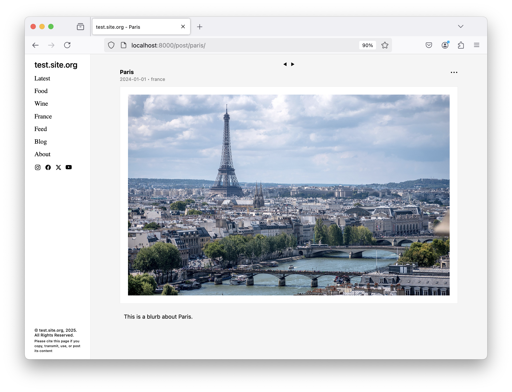
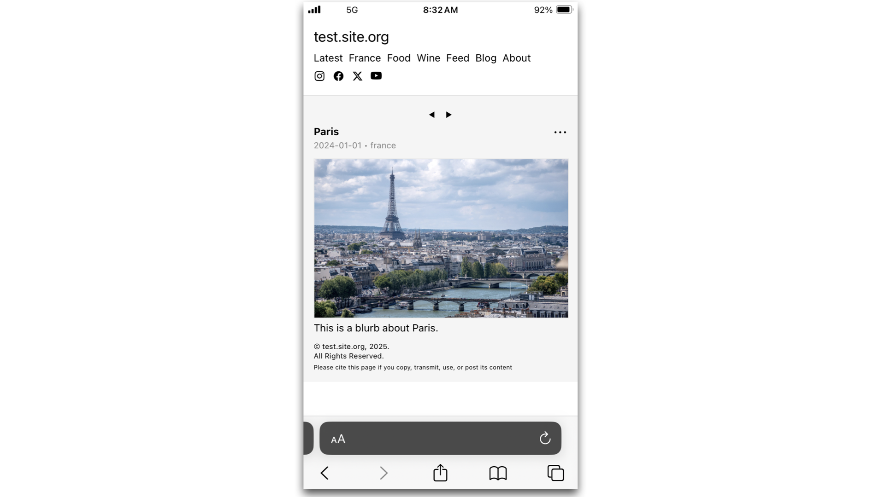
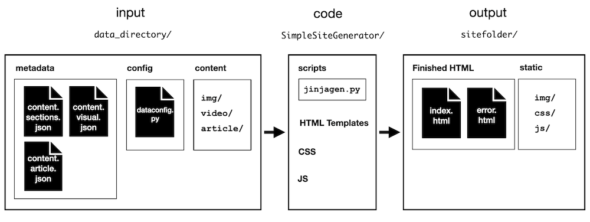
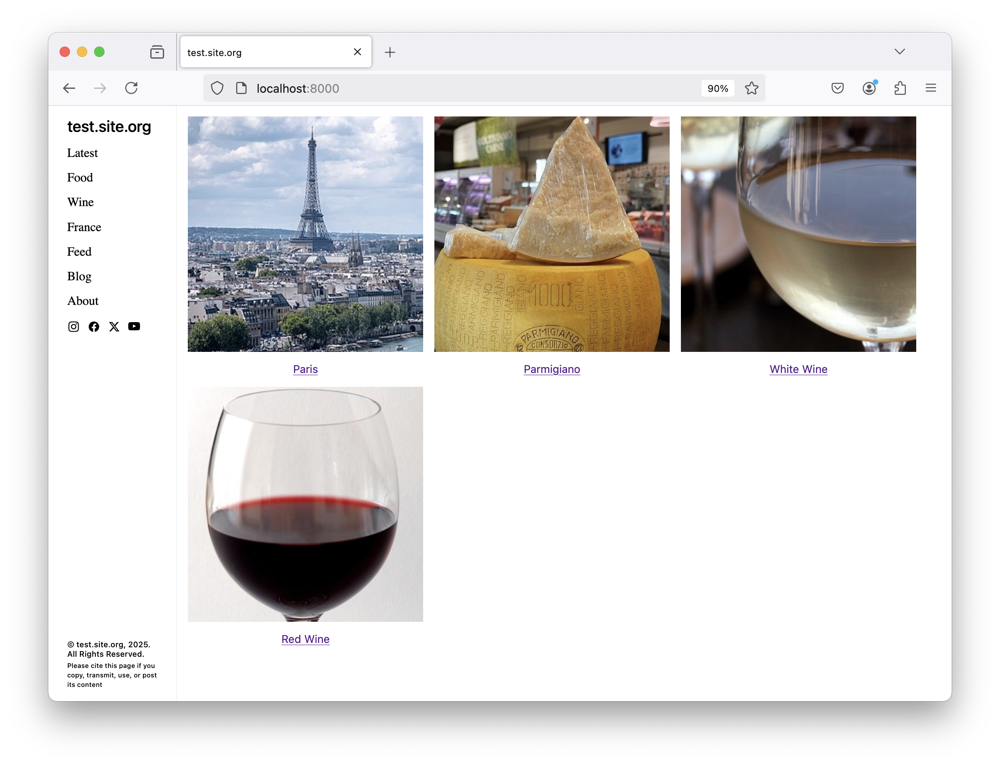

SimpleSiteGenerator ᕦ(ò_óˇ)ᕤ
============================

## Introduction

Welcome to **SimpleSiteGenerator**, a tool to generate static websites.

SimpleSiteGenerator generates a static website based on content input files.
With it, you can create and customize your own site from scratch.
The website is structured as a simple blog—either image-based, article-based, or both.
But you can just as easily make a non-blog website.
SimpleSiteGenerator is written in Python, HTML, and CSS, and you will need some familiarity with these languages to use it.

Here's an example using photos borrowed from Wikipedia:



Mobile view:



Optionally, SimpleSiteGenerator can upload the finished website to an AWS [S3 bucket](https://aws.amazon.com/s3/) for hosting, but having AWS is not a requirement.

## On Static Websites

Static websites have many advantages

 * They're hard to hack. After all, they're just marked up text—no admin panel!
 * They're the cheapest way to host a website: you can save hundreds of dollars compared to, say, buying a Squarespace or Wix website
 * They're fast
 * There's an elegance to their simplicity

If your website doesn't required anything fancy, and is mainly about posting content, then you should consider using a static website.
A good—though not entirely rigid—litmus test is whether you need user accounts:
if you don't need them, this is another hint you should go static.

Setting up a static website is beyond the scope of this project.
A great video describing how to do this on AWS is [How To Host A Website On Amazon Web Services (AWS) - S3, Route 53, CloudFront, & Certificate Manager](https://www.youtube.com/watch?v=lCnymxddies).

## Problems The SimpleSiteGenerator Solves

The SimpleSiteGenerator aims to solve a few problems commonly encountered when building a website.
These include:

 * a way to stay DRY (*"do not repeat yourself"*) and avoid rewriting your common header, footer, and navigation bar for every page
 * a way to convert page objects in a JSON file into actual pages
 * a way to create new posts without writing HTML (at least for visual posts)
 * a way to group posts by category
 * a way to click to the next or previous post in a category
 * an easy way to decide which page, among the many in your site, will serve as your homepage
 * a way to create a Feed page, with your most recent posts
 * a way to create a Latest page, with your latest post
 * a way to create a "Cover page" (aka a splash page) to greet users before they get into your proper website
 * a way to assign specific CSS or JS to a specific page or page type
* a way to assign a specific template to a specific page or page type
 * an easy way to add or remove things from your navigation bar
 * a way to add common social media SVG icons
 * a way of logging build information
 * a default mobile-friendly website whose layout changes based on viewport width

## Dependencies

To use SimpleSiteGenerator, the following programs must be in your `PATH`:

- [python](https://www.python.org/)
- [uglifyjs](https://www.npmjs.com/package/uglify-js)
- [uglifycss](https://www.npmjs.com/package/uglifycss)

The following Python modules must be installed:

- [Jinja](https://jinja.palletsprojects.com/en/stable/)
- [Pandas](https://pandas.pydata.org/)

If you want to sync to AWS, the [AWS CLI](https://aws.amazon.com/cli/) must be in your `PATH`.

## Installation

Clone this repository.


`cd` into it, create a virtual environment, and source it:

```
cd SimpleSiteGenerator
python -m venv venv
source venv/bin/activate
```

Install the required Python packages:

```
pip install -r requirements.txt
```

Or do it manually:

```
pip install Jinja2
pip install pandas
```

Install the required node packages:

```
npm install -g minifier
npm install -g uglify-js
npm install -g uglifycss
```

Test it:

```
mkdir -p logs
./scripts/build.sh x example/test.site.org.data example/test.site.org.sitefolder logs/test.site.org.log.txt x x x
cd example/test.site.org.sitefolder
python -m http.server 8000
```

## Page Objects

**Page objects** are at the heart of SimpleSiteGenerator.
What is a page object?
A page object is simply an object—i.e., something in a JSON file with keys and values—representing the page's metadata.
Let's look at an example page object for a visual-flavor post—the picture of Paris shown above:

```
{
    "name": "Paris",
    "showname": 1,
    "shownamesection": 1,
    "subtitle": "",
    "showsubtitle": 1,
    "type": "img",
    "border": 1,
    "files": "La_Tour_Eiffel_vue_de_la_Tour_Saint-Jacques.jpg",
    "thumbnail": "La_Tour_Eiffel_vue_de_la_Tour_Saint-Jacques_thumb.jpg",
    "url": "paris",
    "urlexternal": "",
    "publishedexternal": "",
    "publish": 1,
    "specialpage": 0,
    "selected": 1,
    "author": "Name",
    "showauthor": 0,
    "category": "france",
    "series": "",
    "keywords": "",
    "date": "2024-01-01",
    "showdate": 1,
    "blurb": "This is a blurb about Paris.",
    "showblurb": 1,
    "paywall": 0,
    "ispreview": 0,
    "description": "",
    "notes": "Image from Wikipedia"
}
```

A quick explanation: the `files` attribute is the name of our image file. The `thumbnail` attribute is the name of our thumbnail file. The `url` attribute, in SimpleSiteGenerator jargon, is a globally unique key associated with the page object. It's related (but not identical) to the URL path where the page will end up being published. Many of the other attributes you see turn various options on or off (the 0s and 1s are "boolean intergers"). You can find the full descriptions of the fields below.

SimpleSiteGenerator's job is to translate these page objects into actual pages on your website.

## An Overview

The SimpleSiteGenerator reads data from a user-specified data directory and then creates a static website in a user-specified output directory. Here's a rough diagram:



### TL;DR

Here's the TL;DR version of how to use this code:

 * Add an entry for your page object in `content.visual.json` (for an image post)
 * Put the content for your post into the data directory
 * Choose various options in `dataconfig.py`
 * Build your website locally with `build.sh`
 * Optionally, upload this folder to a hosting service to make your static website live on the internet

To get started, check out the Quickstart section, as well as the example in:

```
example/test.site.org.data
```

This is the data directory for a fictional website about wine and food.

## Quickstart: How to Create a Post

To create a post, first create a `datafolder/` directory for your website.
The easiest way to do this is to copy the example folder, `example/test.site.org.data/`, then modify it.

### Visual Post

if your post is a picture or video, add an entry for your page object in `content.visual.json` in the data directory. In your page object, choose a unique `url` attribute and set the `publish` attribute to 1. Set the `type` attribute to one of the following:

 * img
 * video

If your post is an image, drop the picture(s) into `published/img/` in the data directory. Put the thumbnail there, too.
If your post is a video, put the video into the `published/video/` folder.
Add the names of these files in the `files` and `thumbnail` attributes of your page object.
If you have a multiple pictures, use a comma-delimited string with no spaces.
E.g.:

```
"files": "picture1.jpg,picture2.jpg,picture3.jpg",
"thumbnail": "picture_thumbnail.jpg"
```

### Article Post

If your post is an article, add an entry for the page object in `content.article.json` in the data directory.
As before, be sure to set the `url` and `publish` attributes. Set the `type` attribute to "article".
In this case, there's no need to set the `files` and `thumbnail` attributes.

In the directory `published/article/`, create a folder **whose name is the url key of your page object**.
Write the content of your post in a file called `content.html`.
If, for example, the url attribute of your page object is *"testarticle1"*, put the `content.html` file here:

```
published/article/testarticle1/html/content.html
```

Any images or videos for the article go in:

```
published/article/testarticle1/img/
published/article/testarticle1/video/
```

The bare-bones data directory looks like this:

```
datafolder
├── content.article.json
├── content.sections.json
├── content.visual.json
├── dataconfig.py
└── published
    ├── article
    │   └── testarticle1
    │       ├── html
    │       │   └── content.html
    │       ├── img
    │       └── video
    ├── img
    │   ├── picture1.jpg
    │   ├── picture2.jpg
    │   ├── picture3.jpg
    │   └── picture_thumbnail.jpg
    └── video
```

If you want to change the default CSS or HTML (JinJa) templates, you'll have to tweak `dataconfig.py` (discussed below).

Build the site with the command:

```
mkdir sitefolder
./scripts/build.sh x datafolder sitefolder log.txt x x x
```

Host it locally (on port 8000):

```
cd sitefolder
python -m http.server 8000
```

### Section Page

If you want to create a section page, with links to multiple posts, first decide what the category of this section will be.
It could be "Food", "Wine", "Miscellaneous", "Vacation Blog", "Baseball", "Bird Photography"—whatever!
Add an object for this section in `content.sections.json`.
You may want to add the url key of your section to the `SIDEBAR` list in `dataconfig.py`, so you can easily navigate to the section.

To make a post visible in the section, set the `category` attribute of the post's page object in `content.visual.json` or `content.article.json`, so it matches the category attribute of the section object you just created in `content.sections.json`.
Re-build the site via `build.sh` to see your changes.

## A Full Example

The directory `example/` contains an example data directory:

```
test.site.org.data
```

along with an empty output directory in which to build the website:

```
test.site.org.sitefolder
```

This is a fictional website about the wine and food of France 🇫🇷, with photos taken from Wikipedia.

Think of the data directory, `test.site.org.data`, as the input.
Its specifications are described in excruciating detail below, but let's peek into this directory before getting too verbose:

```
test.site.org.data/
├── content.article.json
├── content.sections.json
├── content.visual.json
├── dataconfig.py
└── published
    ├── article
    │   ├── about
    │   │   ├── html
    │   │   │   └── content.html
    │   │   ├── img
    │   │   └── video
    │   ├── subscribe
    │   │   ├── html
    │   │   │   └── content.html
    │   │   ├── img
    │   │   └── video
    │   ├── testarticle1
    │   │   ├── html
    │   │   │   └── content.html
    │   │   └── img
    │   └── testarticle2
    │       ├── html
    │       │   └── content.html
    │       └── img
    ├── img
    │   ├── La_Tour_Eiffel_vue_de_la_Tour_Saint-Jacques.jpg
    │   ├── La_Tour_Eiffel_vue_de_la_Tour_Saint-Jacques_thumb.jpg
    │   ├── Parmigiano_Reggiano.jpg
    │   ├── Parmigiano_Reggiano_thumb.jpg
    │   ├── Red_Wine_Glass.jpg
    │   ├── Red_Wine_Glass_thumb.jpg
    │   ├── White_Wine_Glass.jpg
    │   ├── White_Wine_Glass_thumb.jpg
    │   └── france.jpg
    ├── news
    │   └── content.html
    └── video
```

Looking in this directory, you see some JSON files, whose job is to define the metadata of your posts; a configuration file, `dataconfig.py`, to set various options; and content in the form of `content.html` files for article posts and image files for image posts.

To build the website, run:

```
mkdir -p logs
./scripts/build.sh x example/test.site.org.data example/test.site.org.sitefolder logs/test.site.org.log.txt x x x
```

You should see some output like this:

```
********************************************************************************
* bucket: x
* data directory: example/test.site.org.data
* output directory: example/test.site.org.sitefolder
* log file: logs/test.site.org.log.txt
* clean directories first? x
* sync to aws? x
* aws profile x
********************************************************************************

*** Build webpage ***

WARNING: No favicon
WARNING: There are no posts for category: italy
Site title: test.site.org
Site domain: test.site.org
Homepage: selected
Homelink:
Duplicate homepage: False
keywords: food,wine,travel
Visual post categories: ['france', 'food', 'wine', 'italy']
Article post categories: ['blog']
Special pages: ['latest', 'selected', 'feed']
Create Latest Feed: False
Feed length: 5
Visual feed: ['whitewine', 'parmigiano', 'paris', 'redwine']
Article feed: ['testarticle1', 'testarticle2']
All pages: ['latest', 'selected', 'feed', 'france', 'food', 'wine', 'italy', 'blog', 'paris', 'parmigiano', 'whitewine', 'redwine', 'about', 'testarticle1', 'testarticle2']
Sidebar: ['latest', 'france', 'food', 'wine', 'feed', 'blog', 'about']
Favicon:
Avatar:
Base CSS: ['static/css/theme_minimalist.min.css']
Page type specific CSS:
{
    "article": [],
    "visual": [],
    "cover": []
}
url key specific CSS:
{}
CSS Options:
{
    "socialiconsize": 16,
    "thumbnail_width": 300,
    "body_extra": "ssg-text2",
    "main_extra": "",
    "nav_extra": ""
}
Base JS: ['static/js/theme_minimalist.min.js']
Page type specific JS:
{
    "article": [],
    "visual": [],
    "cover": []
}
url key specific JS:
{}
Post type to template dict:
{
    "article": "theme_minimalist.post.article.html",
    "img": "theme_minimalist.post.visual.whitesmoke.html",
    "video": "theme_minimalist.post.visual.whitesmoke.html",
    "sectionarticle": "theme_minimalist.section.article.html",
    "sectionvisual": "theme_minimalist.section.visual.html",
    "error": "theme_minimalist.404.html"
}
Socials (and Email):
{
    "instagram": "https://www.instagram.com/username",
    "youtube": "https://www.youtube.com/@username",
    "twitter": "https://x.com/username",
    "facebook": "https://www.facebook.com/username"
}

Create img page [img]: White Wine at url = /latest/1
Create sectionvisual page [homepage]: Selected at url = /
Create specialpage page [specialpage]: Feed at url = /feed
Create sectionvisual page [sectionvisual]: France at url = /france
Create sectionvisual page [sectionvisual]: Food at url = /food
Create sectionvisual page [sectionvisual]: Wine at url = /wine
Create sectionvisual page [sectionvisual]: Italy at url = /italy
Create sectionarticle page [sectionarticle]: Blog at url = /blog
Create img page [img]: Paris at url = /post/paris
Create img page [img]: Parmigiano at url = /post/parmigiano
Create img page [img]: White Wine at url = /post/whitewine
Create img page [img]: Red Wine at url = /any/url/path/you/want
Create article page [specialpage]: About at url = /about
Create article page [article]: Test Article 1 at url = /post/testarticle1
Create article page [article]: Test Article 2 at url = /post/testarticle2
```

which simply describes some input parameters and the posts which were created.

Once this has run, it will populate the output directory, `test.site.org.sitefolder`, whose structure will now look like this:

```
test.site.org.sitefolder
├── about
│   └── index.html
├── any
│   └── url
│       └── path
│           └── you
│               └── want
│                   └── index.html
├── blog
│   └── index.html
├── error.html
├── feed
│   └── index.html
├── food
│   └── index.html
├── france
│   └── index.html
├── index.html
├── italy
│   └── index.html
├── latest
│   └── 1
│       └── index.html
├── post
│   ├── paris
│   │   └── index.html
│   ├── parmigiano
│   │   └── index.html
│   ├── testarticle1
│   │   └── index.html
│   ├── testarticle2
│   │   └── index.html
│   └── whitewine
│       └── index.html
├── static
│   ├── css
│   │   └── theme_minimalist.min.css
│   ├── img
│   │   ├── La_Tour_Eiffel_vue_de_la_Tour_Saint-Jacques.jpg
│   │   ├── La_Tour_Eiffel_vue_de_la_Tour_Saint-Jacques_thumb.jpg
│   │   ├── Parmigiano_Reggiano.jpg
│   │   ├── Parmigiano_Reggiano_thumb.jpg
│   │   ├── Red_Wine_Glass.jpg
│   │   ├── Red_Wine_Glass_thumb.jpg
│   │   ├── White_Wine_Glass.jpg
│   │   ├── White_Wine_Glass_thumb.jpg
│   │   └── france.jpg
│   ├── js
│   │   └── theme_minimalist.min.js
│   └── video
└── wine
    └── index.html
```

What happened?
You can see there are various "category" pages (such as about, blog, feed, food, france, wine, etc.).
There are also "post" pages (such as paris, parmigiano, redwine, testarticle1, etc.).
The section about France, for example, is here:

```
test.site.org.sitefolder/france/index.html
```

The post about Paris is here:

```
test.site.org.sitefolder/post/paris/index.html
```

Note the page "Selected" at the URL "/". It is the homepage.
You can select which page will be the homepage in `dataconfig.py`.

To host the website locally (on port 8000), run:

```
cd example/test.site.org.sitefolder
python -m http.server 8000
```

You can, e.g., view the post about Paris at *http://localhost:8000/post/paris/*.

The website should look something like this:




In depth explanations for all of these commands are given below.

## How to Build The Website

Suppose your data resides in the folder:

```
/path/to/datafolder
```

And you want to build the site (on your local computer) in the folder:

```
/path/to/sitefolder
```

To build the site, use the script `build.sh`, where the positional arguments are:

 * The AWS S3 bucket name, if present (otherwise set to "x" or any placeholder text)
 * The path to data
 * The folder where the output is generated
 * The file to which logs (from `jinjagen.py`) are written
 * If set to "clean", then DELETE EVERYTHING in outputdir (otherwise set to "x" or any placeholder text)
 * If set to "sync", then sync to aws (otherwise set to "x" or any placeholder text)
 * your AWS CLI profile, if present (see [aws docs](https://docs.aws.amazon.com/cli/latest/userguide/cli-configure-files.html#cli-configure-files-format-profile)) (otherwise set to "x" or any placeholder text)

To build the site, run:

```
./scripts/build.sh x /path/to/datafolder /path/to/sitefolder /path/to/logs/log.txt x x x
```

Test the website on your local computer by running the simple Python web server:

```
cd /path/to/sitefolder
python -m http.server 8000
```

You can view the site at *http://localhost:8000/*.

The `log.txt` file is for your records, and saves information about which pages are using which css, js, and templates; etc.

Suppose you have an S3 bucket, which is set up to host a static website at <i>test.site.org</i>. To build the site, and sync to AWS, run:

```
./scripts/build.sh test.site.org /path/to/datafolder /path/to/sitefolder /path/to/logs/log.txt clean sync myprofile
```

If your AWS bucket is already set up to host a static website, this will copy files to that bucket, and your site will be live on the internet.

## How The SimpleSiteGenerator Works

As mentioned above, the SimpleSiteGenerator reads data from a user-specified data directory and then creates the website in a user-specified output directory.

Before we discuss these directories, let's familiarize ourselves with some terminology specific to this repository. In the SimpleSiteGenerator, there are two post "flavors":

- a visual-flavor post
- an article-flavor post

A **visual post page** is a page for a visual-flavor post (i.e., an image or video). The default URL structure will be something like: *test.site.org/post/mypicture*. Note the *post/* component of the URL. You can customize the URL, but more on that later. Visual posts are defined in the `content.visual.json` file.

An **article post page** is a page for an article-flavor post—primarily text, but which can include images and video. The default URL structure will be something like: *test.site.org/post/myarticle*. Again, note the *post/* in the URL. Article posts are defined in the `content.article.json` file.

Broadly, the SimpleSiteGenerator has a few different page types:

- a post (either visual-flavor or article-flavor)
- a section page (which lists a grouping of either visual posts or article posts)
- an error page (for errors)
- a special page (anything other than the above)

A **post** is a page for a visual-flavor or article-flavor post, as we've already described.

A **section page** is a page which has the links for a set of (visual or article) posts of a given category. The default URL structure will be something like: *test.site.org/wine* or *test.site.org/vacationpictures* (Note the lack of the word "post" in the URL). The section pages are defined in the `content.section.json` file.

A **special page** is a page such as the "About" section (*test.site.org/about*). It's not a post because it will not be taken up and down. It's a permanent part of the fabric site. Special pages include your homepage or landing page, and are discussed in detail below. The URL of a special page omits the *post/* bit, just as with a section page. Special pages come into being in two ways:

 1. You can toggle the `specialpage` attribute in one of the content json files (described below)
 2. You can define them in `l_SPECIAL_PAGES` in `dataconfig.py` (described below)

One other term deserves comment.
In the SimpleSiteGenerator, the term "url" has a specific meaning.

**`url` is a globally unique key associated with a page object.**

Let's say we set the `url` attribute to "wine" for a page object representing a post about wine.
And let's say the actual URL is *https://test.site.org/post/wine*. Here is the terminology as it's used in the SimpleSiteGenerator documentation:

 * **url** == *wine*. A unique key associated with the page object.
 * **urlpath** == *post/wine*. The non-root component of the actual URL—and the location where your page is built in the site output directory.
 * **URL** == *https://test.site.org/post/wine*. The actual URL, as the term is used in common parlance. I capitalize this to distinguish it.

## JSON Files in The Data Directory

The data directory is where the SimpleSiteGenerator reads its data from.
It must contain the following files:

- `content.visual.json`, which describes the visual-flavor posts
- `content.article.json`, which describes the article-flavor posts
- `content.sections.json`, which describes the section pages

These are described in detail below.

### `content.visual.json`

To make a visual post, you have to add an entry to `content.visual.json` in the data directory.
By modifying this file, you can add, subtract, or update content without writing any HTML.

Here's an example entry in `content.visual.json` for a post about Parmigiano cheese:

```
    {
        "name": "Parmigiano",
        "showname": 1,
        "shownamesection": 1,
        "subtitle": "",
        "showsubtitle": 1,
        "type": "img",
        "border": 1,
        "files": "Parmigiano_Reggiano.jpg",
        "thumbnail": "Parmigiano_Reggiano_thumb.jpg",
        "url": "parmigiano",
        "urlexternal": "",
        "publishedexternal": "",
        "publish": 1,
        "specialpage": 0,
        "selected": 1,
        "author": "Name",
        "showauthor": 0,
        "category": "food",
        "series": "",
        "keywords": "food",
        "date": "2024-05-03",
        "showdate": 0,
        "blurb": "Cheese!",
        "showblurb": 0,
        "paywall": 0,
        "ispreview": 0,
        "description": "",
        "notes": "Image from Wikipedia"
    }
```

Two optional fields, `urlpath` and `template`, are not shown but are described below.

The fields are as follows:

- `name` (str) is the name or title of the post
- `showname` (0 or 1) is a boolean int which governs whether to print the name of the post on the post page
- `shownamesection` (0 or 1) is a boolean int which governs whether to print the name of the post on the section page
- `subtitle` (str) is the subtitle of the post (currently only implemented for article type posts)
- `showsubtitle` (0 or 1) is a boolean int which governs whether to print the subtitle on the post page
- `type` (str) is either:
  * "img": for a visual-flavored post with images
  * "video": for a visual-flavored post with video
  * "article": for an article-flavored post
- `template` (str) (**optional**) is the template in `templates/` to be used for this page. *Note*: this will override the template specified by page type in `d_TYPE2TEMPLATE`. See the discussion about templates below
- `border` (0 or 1) is a boolean int which governs to show a light border around the img (only implemented for visual type posts)
- `files` (str) is the name of the img or video file for the post (only implemented for img or video type posts). Use comma-delimiting if multiple files. The code looks for these files in the folders `published/img/` or `published/video/` in the data directory
- `thumbnail` (str) is the name of the thumbnail file. The code looks for this file in the data directory, in the folder `published/img/`. *Note*: all thumbnails are assumed to be the same dimensions
- `url` (str) is a globally unique key associated with your page object. It should not contain slashes. If `url` is set to "parmigiano", the default actual URL for test.site.org will be *https://test.site.org/post/parmigiano* (assuming https). The following url keys are reserved and may not be used for ordinary posts:
  * cover
  * latest
  * selected
  * feed
  * post
- `urlpath` (str) (**optional**) is a string which, if set, will create your post at this path. For example, if you set `urlpath` to "my/random/path", your post will be built at *my/random/path/parmigiano* rather than the default *post/parmigiano*
- `urlexternal` (str) refers to an external link associated with the post—if, e.g., it was published on another website (for now, this doesn't appear anywhere on the website - it's just for your record keeping)
- `publishedexternal` (str) notes where the post was published on an external website—e.g., "Instagram Story" (for now, this doesn't appear anywhere on the website - it's just for your record keeping)
- `publish` (0 or 1) is a boolean int which governs whether or not to publish this post
- `specialpage` (0 or 1) is a boolean int which governs whether the post is a special page. Special pages are discussed below. In general, if the url key is set to "parmigiano" and specialpage is set, the actual URL for test.site.org will change from *https://test.site.org/post/parmigiano* to *https://test.site.org/parmigiano*. The idea is that a special page transcends a post
- `selected` (0 or 1) is a boolean int which, if True, will cause the post to appear on the special page "Selected" defined in `dataconfig.py` (see the section on Special Pages below)
- `author` (str) is the author name
- `showauthor` (0 or 1) is a boolean int which, if True, displays the author on the post page (currently only implemented for article type posts)
- `category` (str) is the category associated with your post. The category should correspond to the `category` attribute of one of the section objects defined in `content.sections.json`. *Note*: If you want to use multiple categories (comma-delimited), see discussion below. *Note*: The category can be the empty string, but leaving the category off will result in no section page having a link to your post
- `series` (str) is a string denoting the series this post is part of
- `keywords` (str) is a comma-delimited string of keywords associated with the post (Not yet implemented)
- `date` (str) is the date, formatted as *YYYY-MM-DD*
- `showdate` (0 or 1) is a boolean int which, if True, displays the date on the post page
- `blurb` (str) is a blurb associated with the post
- `showblurb` (0 or 1) is a boolean int which, if True, displays the blurb on the post page
- `paywall` (int) (0 or 1) is a boolean int which, if True, denotes the post is paywalled. (Not yet implemented, other than to display a small lock SVG next to the post title)
- `ispreview` (0 or 1) is a boolean int which, if True, denotes this post is only a preview (Not yet implemented)
- `description` (str) is a description of this page object (this doesn't appear anywhere on the website - it's just for your record keeping)
- `notes` (str) any notes (this doesn't appear anywhere on the website - it's just for your record keeping)

A note about the `url` attribute: as we're already mentioned, `url` is not the actual URL you'll see in your web browser.
Instead, SimpleSiteGenerator uses `url` as a unique identifier, or key, for the page object.
So how is the actual URL determined?
The codebase makes default choices for you.
A post defaults to

 * *https://test.site.org/post/parmigiano*

while a section or special page defaults to

 * *https://test.site.org/parmigiano*

How does this work?
In the example above—an ordinary post—the `url` is set to "parmigiano", while the the page is built at *post/parmigiano*.
To keep track of this, the codebase adds another attribute, `urlpath`, to the page object and sets this to "post/parmigiano".

What if you want to override the defaults?
If you want your post to be at a path other than *post/parmigiano*.
You can set the `urlpath` attribute directly in your page object.
For example, if you set `urlpath` to "my/random/path", your post will be built at *my/random/path/parmigiano*.

What if you want to make a post your homepage and put it at the root URL path?

 * *https://test.site.org*

This is handled by setting the variable `HOMEPAGE` in the configuration file `dataconfig.py` to your post's url key.
It's discussed in detail below.

A note about categories: As already mentioned, a post's `category` should match the `category` of one of the objects defined in `content.sections.json`. If your post's `category` has multiple comma-delimited categories: e.g.,

```
"category": "food,wine,france"
```

this creates a bit of a issue, which is that when you use the navigation arrows, `⏴ ⏵`, from the post view, you expect to navigate to other posts of the same category. This can only work for a single category and the first category is used for this purpose. Thus, in the example above, clicking an arrow would move through the "food" category, even if you got to the post via the "wine" section.

The only way to solve this is to set `urlpath` directly and use a url structure that includes the category (e.g., *food/post/* and *wine/post/*), then duplicate your post, so there's one in each section (each with a unique url key, of course). If you do not want to set `urlpath`, you should only use a single category per post. For now, you will get warned if you use multiple categories.

### `content.article.json`

`content.article.json` has the same fields as `content.visual.json`.

A few fields have different roles in `content.article.json`. Namely:

- `subtitle` (str) is the subtitle of your article
- `showsubtitle` (0 or 1) is a boolean int which governs whether to print the subtitle
- `border` is moot for articles
- `files` is moot for articles
- `thumbnail` is moot for articles

### `content.sections.json`

To define a new section, you should create an entry in the `content.sections.json` file.

For example, here are some entries in the `content.sections.json` file for our fictional website—one for a section with food pictures and one for a section with wine pictures:

```
    {
        "name": "Food",
        "showname": 0,
        "subtitle": "",
        "showsubtitle": 0,
        "category": "food",
        "url": "food",
        "publish": 1,
        "specialpage": 0,
        "type": "sectionvisual",
        "blurb": "",
        "showblurb": 0,
        "description": "",
        "notes": ""
    },
    {
        "name": "Wine",
        "showname": 0,
        "subtitle": "",
        "showsubtitle": 0,
        "category": "wine",
        "url": "wine",
        "publish": 1,
        "specialpage": 0,
        "type": "sectionvisual",
        "blurb": "",
        "showblurb": 0,
        "description": "",
        "notes": ""
    }
```

The fields are as follows:

- `name` (str) is the name of the section
- `showname` (0 or 1) is a boolean int which, if True, displays the title on the page
- `subtitle` (str) is the section subtitle
- `showsubtitle` (0 or 1) is a boolean int which, if True, displays the section subtitle
- `template` (str) (**optional**) is the template in `templates/` to be used for this page. *Note*: this will override the template specified by page type in `d_TYPE2TEMPLATE`. See the discussion about templates below
- `category` (str) is the category name. The category an all-important attribute which determines which posts will get lumped together into this category bucket. *Note*: in `content.sections.json` category must be unique, and entries may not have multiple categories
- `url` (str) is a globally unique key associated with your page object. For section page objects, if this is set to "wine", the actual URL will be *test.site.org/wine*
- `urlpath` (str) (**optional**) is a string which, if set, will create your page at this path
- `publish` (0 or 1) is a boolean int which governs whether to publish this section or not
- `specialpage` (0 or 1) is a boolean int which, if True, denotes this is a special page. For the sections, because they are not posts, this distinction doesn't matter much
- `type` (str) is either:
  * "sectionvisual"
  * "sectionarticle"
- `blurb` (str) is a blurb associated with the section
- `showblurb` (0 or 1) is a boolean int which, if True, displays the blurb on the page
- `description` (str) is a description of this section (this doesn't appear anywhere on the website - it's just for your record keeping)
- `notes` (str) any notes (this doesn't appear anywhere on the website - it's just for your record keeping)

*Nota bene*:

**Every entry in `content.sections.json` must have a unique `category` attribute.**

## The Configuration File

The data directory must also contain your website's configuration file, `dataconfig.py`.

### `dataconfig.py`

The `dataconfig.py` file has many important configuration options for your website.
Modifying this file is one of the fundamental tasks you will need to do to build your site.

 * What's your page's title?
 * What's in your navigation bar?
 * Which page is serving as your homepage?
 * Which special pages do you want to activate?

All these questions—and many more—are mediated by `dataconfig.py`.

`dataconfig.py`  has the following constants:

 * `SITETITLE` is the site name, which appears as text on your webpage (e.g., French Wines)
 * `DOMAIN` is the domain name (e.g., frenchwines.com). This appears in your footer
 * `SITEWORDS` are site keywords which appear in the HTML `<head>` tag
 * `SITEAUTHOR` is the site author which appears in the HTML `<head>` tag
 * `EMAIL` is your public contact email
 * `HOMEPAGE` is the url key of the page object you want to serve as your homepage
 * `HOMELINK` is the url key of the page object that your homepage will link to when you click on the `SITETITLE` text on your website (discussed below)
 * `SIDEBAR` is a list of url keys that will appear in your navigation bar
 * `d_SOCIALMEDIA` is a dict with your handles for social media (e.g., Instagram, Youtube, etc.)
 * `FAVICON` is your site's favicon
 * `AVATAR` is the path to your avatar img file in your output directory
 * `NUMPOSTSFEED` is the number of most recent posts to show on the feed special page. This parameter only matters if you've turned on the special Feed page or if `LATESTFEED` is on
 * `SHOWNEWS` is a boolean which, if True, shows a news box on landing page
 * `DUPLICATEHOME` is a boolean which, if True, means that the homepage page will have two paths on your website: one at the root url path, and one at its normal url attribute (discussed below)
 * `LATESTFEED` is a boolean which, if True, creates a Latest Feed set of pages containing `NUMPOSTSFEED` pages. See the dicussion below
 * `BASE_JS` is a list of the JS file paths (in the output directory) for every page of your website. This controls the main JavaScript for your website
 * `d_TYPE2JS` is a dict of page type-specific JS files, so you can run certain JS scripts by page type. In this dict, the keys are page types and the values are JS file paths in the output directory
 * `d_URL2JS` is a dict of url key-specific JS files, so you can run certain JS scripts according to url key. This is the most granular level. In this dict, the keys are url keys and the values are JS file paths in the output directory
 * `BASE_CSS` is a list of the CSS file paths (in the output directory) for every page of your website. This controls the main CSS for your website
 * `d_TYPE2CSS` is a dict of page type-specific CSS files, so you can link certain CSS files by page type. In this dict, the keys are page types and the values are CSS file paths in the output directory
 * `d_URL2CSS` is a dict of url key-specific CSS files, so you can link  CSS files according to url key. This is the most granular level. In this dict, the keys are url keys and the values are CSS file paths in the output directory
 * `d_CSS` has various global CSS parameters (discussed below)
 * `d_TYPE2TEMPLATE` is a dict mapping page type to template. If you want a template for a specific page, you can override this by specifying a template directly in the page object (discussed below)
 * `l_SPECIAL_PAGES` is a list data structure which describes more special pages you can turn on or off (discussed below)

Some of these deserve further comment:

### Sidebar (Navbar)

The sidebar is defined in `dataconfig.py`.
It determines what will be in the sidebar and its ordering.

For example, for the fictional website about French wine and food, it could be:

```
SIDEBAR = [
    'latest',
    'food',
    'wine',
    'france',
    'blog',
    'about'
]
```

This is a list of url keys.
You can use any url attribute you have defined in `content.article.json`, `content.sections.json`, or `content.visual.json`; or in `l_SPECIAL_PAGES` in `dataconfig.py`.

If you modify the HTML template, you could convert the sidebar into a menu, or put it somewhere other than the left sidebar.

### `HOMEPAGE`

`HOMEPAGE` is the url key of the page object you want to serve as your homepage. There must be a page object with this `url` attribute in either 
 `content.article.json`, `content.sections.json`, `content.visual.json`, or `l_SPECIAL_PAGES`.

For example, in our test website you could set it to the post about cheese:

```
HOMEPAGE = 'parmigiano'
```

Or you could set it to the special cover (splash) page:

```
HOMEPAGE = 'cover'
```

etc.


`HOMELINK` is the link address that your homepage will link to when you click on the `SITETITLE` text on your website. You might want it to be different than your homepage if, say, the homepage is the special cover page, and you don't want the user to return to this location after they've seen it once.
Then you could set, say:

```
HOMELINK = 'selected'
```

and this would be your *de facto* homepage.

`DUPLICATEHOME` is a boolean you can turn on to have the page functioning as your homepage also get created at its non-homepage url.
For example, if the homepage is your parmigiano cheese post, turning this on would create the page both at the root url as well as at *post/parmigiano*.
If the homepage is the special cover page, you will want to turn `DUPLICATEHOME` off.

### Adding CSS and JS

SimpleSiteGenerator adds CSS through three variables, which correspond to three levels of granularity.
You can add CSS page-wide with `BASE_CSS`.
You can add it to a specific page type with `d_TYPE2CSS`.
Or you can add it by individual page url key with `d_URL2CSS`.

The same idea goes for the JavaScript you want to add.

Let's look at an example:

```
BASE_CSS = [
    'static/css/theme_minimalist.min.css'
]

d_TYPE2CSS = {
    'article': [
        'static/css/article.min.css',
        'static/css/codestyle.min.css'
    ],
    'img': [],
    'video': []
}

d_URL2CSS = {
    'cover': [
        'static/css/coverpage.min.css'
    ]
}
```

This would do the following:

* all pages link `theme_minimalist.min.css` CSS
* article type posts link `article.min.css` and `codestyle.min.css` CSS
* your cover page with (`url == 'cover'`) links `coverpage.min.css` CSS

### `d_CSS`

`d_CSS`, a dict with various parameters, is yet another way* to add global CSS to your site. It has various CSS parameters. E.g.,

```
d_CSS = {
    'socialiconsize': 16,
    'thumbnail_width': 300,
    'body_extra': 'ssg-text2',
    'main_extra': '',
    'nav_extra': ''
}
```

 - `socialiconsize` is the size in pixels of social media icons. E.g., if it's 24,then the size will be 24x24
 - `thumbnail_width` is the thumbnail width for imgs on the image section pages
 - `body_extra` is any extra css class to be applied to the `<body>` tag (e.g., a rule for the site-wide font)
 - `main_extra` is any extra css class to be applied to the tag with class `ssg-main` (e.g., a rule for the background color)
 - `nav_extra` is any extra css class to be applied to the tag with class `ssg-nav` (e.g., a rule for the font)

*Why do we need `d_CSS` if we already have `BASE_CSS`, `d_TYPE2CSS`, and `d_URL2CSS`?
The truth is, we don't.
We could just as easily make new templates which use different CSS rules, and invoke them via `BASE_CSS`, `d_TYPE2CSS`, and `d_URL2CSS`.
But this tends to get unDRY.
There's a tradeoff here, between trying to stay DRY, on the one hand, and keeping too much conditional logic out of the JinJa templates, on the other.
`d_CSS` is a compromise in this tug-of-war so you can, say, change the font in your nav bar without having to make all new templates. 

### Socials (and Email)

Links for social media, as well as email, are defined in `dataconfig.py`, in the constant `d_SOCIALMEDIA`:

```
d_SOCIALMEDIA = {
    'instagram': 'https://www.instagram.com/username',
    'youtube': 'https://www.youtube.com/@username',
    'twitter': 'https://x.com/username',
    'facebook': 'https://www.facebook.com/username',
    'linkedin': 'https://www.linkedin.com/company/username',
    'tiktok': 'https://www.tiktok.com/@username',
    'bluesky': 'https://bsky.app/profile/username',
    'reddit': 'https://www.reddit.com/r/username/',
    'github': 'https://github.com/username',
    'mail': 'myemail@email.com'
}
```

Upate the links with your username and comment out the ones you don't want to use.

You can add other social media links.
However, currently these are the only ones for which SimpleSiteGenerator has SVG icons.

## Special Pages

Special pages are anything other than an ordinary post or a section page.
Special pages might include: a Contact Page; an About Page; a Subscription Page; a Help Page; a Feed Page containing most recent posts; etc.

Let's take the About Page as an example.
You probably want this to be at the URL *test.site.org/about* as opposed to  *test.site.org/post/about*.
This is the essence of special pages: posts come and go, but special pages are more permanent and don't have a *post/* component in their actual URL.

There are two ways to make special pages in the SimpleSiteGenerator.
One way is to "promote" an ordinary page to special page status.
To do this, simply make an ordinary post and set the `specialpage` attribute.
For example, to make an "About" page, add an entry in `content.article.json`; set `specialpage = 1`; and populate the folder `published/article/about/`.

However, this only goes so far.
What if we want our special page to be exotic than a mere post?
For example, suppose we want a dedicated page for the latest post.
Or suppose we want a feed which displays the most recent posts.
Or suppose we want a selected section, which shows selected posts.
None of these are vanilla posts, so we cannot create them by merely promoting ordinary posts to special status. This is where `l_SPECIAL_PAGES` in `dataconfig.py` comes into play.
The other way to create a special page in the SimpleSiteGenerator is add an entry to this list.
This is for more exotic (read: non-post-like) special pages.

Let's look at an example `l_SPECIAL_PAGES`:

```
    {
        "name": "Cover",
        "url": "cover",
        "publish": 1,
        "specialpage": 1,
        "blurb": "",
        "showblurb": 0,
        "type": "article",
        "template": "theme_minimalist.cover.html",
        "description": "A coverpage which doesn't inherit from theme_minimalist.base.html",
        "notes": ""
    },
    {
        "name": "Latest",
        "url": "latest",
        "publish": 1,
        "specialpage": 1,
        "blurb": "",
        "showblurb": 0,
        "type": "img",
        "template": "theme_minimalist.post.visual.html",
        "description": "The single most recent post",
        "notes": "type is subject to change, as this could be either img or video"
    },
    {
        "name": "Selected",
        "showname": 0,
        "url": "selected",
        "publish": 1,
        "specialpage": 1,
        "blurb": "",
        "showblurb": 0,
        "type": "sectionvisual",
        "template": "theme_minimalist.section.visual.html",
        "description": "A smattering of selected posts",
        "notes": ""
    },
    {
        "name": "Feed",
        "url": "feed",
        "publish": 0,
        "specialpage": 1,
        "blurb": "The latest 5 posts",
        "showblurb": 0,
        "type": "specialpage",
        "template": "theme_minimalist.feed.visual.html",
        "description": "The Feed is a page with a limited number of recent posts",
        "notes": ""
    }
```

The fields are as follows:

- `name` (str) is the name of the page
- `showname` (0 or 1) is a boolean int which, if True, displays the title on the page
- `url` (str) the globally unique key associated with your page object
- `publish` (0 or 1) is a boolean int which governs whether to publish the page or not
- `blurb` (str) is a blurb associated with the page
- `showblurb` (0 or 1) is a boolean int which, if True, displays the blurb on the page
- `type` (str) is either:
  * sectionvisual
  * sectionarticle
  * img
  * video
  * article
  * specialpage
- `template` (str) is the template in `templates/` to be used for this page. This overrides the template specified in `d_TYPE2TEMPLATE`
- `description` (str) is a description of the page (this doesn't appear anywhere on the website - it's just for your record keeping)
- `notes` (str) is any notes (this doesn't appear anywhere on the website - it's just for your record keeping)

There are a number of special pages here:

- **cover** is a cover (splash) page which does *not* inherit from `theme_minimalist.base.html` but which, like an article flavor post, does read a `published/article/cover/html/content.html` file
- **latest** is a special visual-flavor post that is your most recent post
- **selected** is a special section page of selected posts. This is populated by objects in `content.visual.json` where `selected == 1`
- **feed** is a special page which displays a number of most recent posts (the `NUMPOSTSFEED` variable in `dataconfig.py` defines how many)

What if you want a non-post special page not included here?
In this case, you have to modify the codebase on your own.

## Folders in The Data Directory

The data directory must have the following directories:

- `published/article` is where article-flavor posts reside
- `published/img` is where image files for image-flavor posts reside
- `published/video`is where video files for image-flavor posts reside
- `published/news` is where you can place an HTML snippet proclaiming news

### Image Content

The JSON discussed above, `content.visual.json`, specifies image files via the `files` attribute, but where do they live?

As already noted, the files for all image posts—as well as all thumbnails—reside in `published/img`. E.g.:

```
published/img/image1.jpg
published/img/image2.jpg
```

Similarly, the files for all video posts reside in `published/video`. E.g.:

```
published/img/video1.mp4
published/img/video2.mp4
```

### Article Content

The `published/article` folder is where the SimpleSiteGenerator looks for published articles. Articles are more complicated than simple images because articles contain html and can themselves contain images and video. 

**Every article must have a folder in the `published/article/` whose name is the url key of the page object.**

For example, an article with:

```
"url": "testarticle1"
```

in `content.article.json` requires the folder:

```
published/article/testarticle1/html/
```

If the article has images or video, it also needs:

```
published/article/testarticle1/img/
published/article/testarticle1/video/
```

These are where the html and associated images for "testarticle1" live.

**The article content must be in a file called `content.html`.**

E.g.:

```
published/article/testarticle1/html/content.html
```

SimpleSiteGenerator reads this file to populate your article with content.

### News

The `published/news` folder has any the contents for display in the news box.
This must be in the following file:

```
published/news/content.html
```

You can turn news on and off new via `SHOWNEWS` in `dataconfig.py`.

## The SimpleSiteGenerator Repository

Now we will make a shift away from the Data Directory and discuss files and scripts in the SimpleSiteGenerator repository.
It contains the following folders:

- `scripts` is the folder which contains the code to build the website
- `static` is where the CSS and JS live
- `templates` is where the HTML (JinJa) templates live
- `example` contains a full example

These are described in detail below.

In the meantime, let's review the diagram we saw above:


## Scripts

In the `scripts/` folder, you'll find the following scripts:

- `jinjagen.py` is the main script of the whole operation
- `colorme.py` is a minor helper script to print stuff to the console in color
- `add_assets.sh` copies static assets from the data directory to the output directory
- `sync.toaws.sh` syncs the finished webpage to an AWS S3 bucket
- `build.sh` is a wrapper which runs the scripts: `jinjagen.py`, `add_assets.sh`, and `sync.toaws.sh`

as well as a configuration file:

- `siteconfig.py` is a file which has some constants for the site

### `jinjagen.py`

`jinjagen.py` is the main script which builds the website.
It takes the following arguments:

```
usage: jinjagen [options]

options:
  -h, --help            show this help message and exit

  -t TEMPLATES, --templates TEMPLATES
                        Path to JinJa templates

  -d DATA, --data DATA  Path to the data folder

  -o OUTPUTDIR, --outputdir OUTPUTDIR
                        output directory

  --logfile LOGFILE     Path to the log folder (omit to suppress logging)

  --nostrict            Turn off strict mode

  -v, --verbose         Turn on verbose mode
```

How does `jinjagen.py` work?

It does a number of things:

 * It reads data from the data directory, creating data structures for sections, visual-flavor posts, and article-flavor posts
 * It filters out unpublished articles and does some basic error checking (e.g., no URL collisions)
 * It creates the directory structure for posts in the output directory
 * It makes a common "props" (properties) dict, which includes sidebar info, CSS file paths, etc. This will be passed to every page
 * For a given post, it seeds the appropriate template with page object data; the common props dict; and the user-added content. Then it writes this into the `index.html` file in the appropriate output folder

### `siteconfig.py`

The `siteconfig.py` file has some constants. It is not as important as `dataconfig.py`, and you probably won't need to touch it.
It's mostly for error checking.

`siteconfig.py` has the following constants:

 * `VERSION` is the version of this codebase
 * `RESERVED` is a list of special reserved urls and words which not be used as ordinary post url keys
 * `ALLOWED_TYPES` is a list which describes the allowed of page types. Currently, it's:
   * sectionvisual
   * sectionarticle
   * img
   * video
   * article
   * specialpage
   * error
 * `ALLOWED_SOCIAL` is a list which describes the (recognized) social media types
 * `REQUIRED_POST_FIELDS` is a list of required fields for post page objects
 * `REQUIRED_SECTION_FIELDS` is a list of required fields for section page objects

## CSS Theme

The style sheets for this project reside in:

```
static/css/
```

The current CSS Theme is from the file:

```
theme_minimalist.css
```

As already discussed, you can change the global theme in `dataconfig.py` by tweaking `BASE_CSS`.
If you want to make more granular changes, use `d_TYPE2CSS`, and `d_URL2CSS`.

To give your website a unique look and feel, you can customize this CSS file or add your own.
Needless to say, design is a huge part of what gives your webpage its identity.
When writing your own CSS, remember: Flexbox is your best friend!

### Mobile-Friendly-ness

The SimpleSiteGenerator aims to make the website mobile-friendly, so its layout looks good whether you look at it on a computer or a phone.
The default CSS, `theme_minimalist.css`, accomplishes this via media-queries.
The current breakpoint is 500px.
At this screen width, the sidebar disappears and turns into a header bar.
And generally speaking, rows change into columns.

## JS

The current JavaScript resides in:

```
static/js/
```

The current JS is from the file:

```
theme_minimalist.js
```

For now, there's barely any JS.

## HTML Templates

When writing HTML for your website, you want the code to be reasonably DRY. For the pages across your site, you're probably going to want to the same header, footer, sidebar, etc. The SimpleSiteGenerator accomplishes this by using JinJa as a templating engine. There's a template called `templates/theme_minimalist.base.html` from which most pages inherit.

The HTML templates reside in:

```
templates/
```

Some of the templates are as follows:

- `theme_minimalist.base.html`: The base template, from which most pages inherit
- `theme_minimalist.404.html`: The error page
- `theme_minimalist.post.visual.html`: A page for a visual-flavor post
- `theme_minimalist.post.article.html`: A page for an article-flavor post
- `theme_minimalist.section.visual.html`: A page for a visual-flavor section - i.e., a page with links to a particular subset of visual posts (e.g., food category pictures; or wine category pictures)
- `theme_minimalist.section.article.html`: A page for an article-flavor section - i.e., a page with links to a particular subset of article posts
- `theme_minimalist.feed.visual.html`: A page for the visual feed (i.e., the top x visual posts)

As mentioned already, you choose which page types get which templates via `d_TYPE2TEMPLATE` in `dataconfig.py`. This maps a page type, such as "article", to a template.

If you want to specify the template in the most granular fashion, you can add `template` as an attribute to an individual page object in `content.visual.json`, `content.article.json`, `content.sections.json`, or `l_SPECIAL_PAGES`.

To give your website a unique look and feel, you can create your own templates.

### Footer

The HTML fragment defining the footer snippet is:

```
fragment.footer.html
```

You can modify this to change your footer.

### Social Media Icons

The HTML fragment defining the layout of the social media icons is located in:

```
fragment.socialmedia.html
```

You can modify this to change the order (etc.) of these icons.

## The Site (Output) Directory

We're close to the end of our static website journey!
Once we've run all the code, and built our website, the output will live in the output directory (e.g., `test.site.org.sitefolder/`). We will finish by examining what the SimpleSiteGenerator has deposited in this directory.

In general static websites mimic linux directory structures. Every time you want a page at a particular path, you drop an `index.html` file into it.
For example, your homepage will reside at:

```
test.site.org.sitefolder/index.html
```

corresponding to *test.site.org*, while

```
test.site.org.sitefolder/about/index.html
```

corresponds to *test.site.org/about*, and

```
test.site.org.sitefolder/blog/post1/index.html
```

corresponds to *test.site.org/blog/post1*, and so on.

This is the job of the main script, `jinjagen.py`. It reads stuff in the data directory, expecting the files and structure we described above, and makes this structure in the output directory, which will become your website.

SimpleSiteGenerator will also put static assets in the folders:

```
test.site.org.sitefolder/static/css/
test.site.org.sitefolder/static/js/
test.site.org.sitefolder/static/img/
test.site.org.sitefolder/static/video/
```

## Tips

### Sizing Images

The image thumbnails are what the user sees on the visual section pages.
The way the site is set up, all image thumbnails are assumed to be the same dimensions (both height and width).
You have to make this happen yourself.

### Understanding the CSS Layout

To understand the current layout rules, one trick you can do is to find the comment marked "Debug" in `theme_minimalist.css` and uncomment the rule for `div`, which will put a thin border around every `div`. This will show you how the `div`s comprise the page.

### More on The Hompage

If you have a blog, the special page "latest" is a good candidate for your homepage.

### Version Control

You should use git to version control the files in your data directory:

 * `content.article.json`
 * `content.sections.json`
 * `content.visual.json`
 * `dataconfig.py`

This will allow you to track the evolution of your content.

### Debugging

To debug a particular page, set `DEBUG` to the url key in question in `jinjagen.py`.
You'll find this constant at the top of the script.

## Quirks, Problem, and *to-do*s

To-do list:

 * Fix the fact that special pages Latest, Feed, and Selected are only implemented for visual posts
 * Add audio-flavor posts
 * Implement password protection for certain posts
 * Add a paywall or preview option
 * Convert the CSS to Sass (?) and/or try to namespace it better and add variables
 * Find a way to DRY up templates without adding too much conditional logic?
 * Make more mobile friendly
 * `add_assets.sh` copies all CSS and JS to the folder even files are that not used - fix this
 * Add webpack for fancier JS?
 * Add more CSS themes and examples

## How Does SimpleSiteGenerator Compare to Other Frameworks?

There are a lot of perfectly good static web frameworks out there.
The other frameworks are more mature, have better docs, and have teams behind them.
So why this one? No reason, other than that I wanted to do it my own way.

The first selling point of SimpleSiteGenerator is that it's written in Python.
I'm a Python partisan.
No need to learn Ruby (as with [Jekyll](https://jekyllrb.com/)) or download a binary (as with [HUGO](https://gohugo.io/)).

The second selling point is, it's simple. At its core, it's just one Python script! Among the current static site generators out there, SimpleSiteGenerator is spirtually closest to [Pelican](https://docs.getpelican.com/en/latest/). However, SimpleSiteGenerator is more minimalist.

The third selling point is, SimpleSiteGenerator uses JinJa for templating. JinJa's homepage states: *"Special placeholders in the template allow writing code similar to Python syntax".* Say no more! I like JinJa better than HUGO's Go templates or Jekyll's Liquid templates.

The fourth is, it supports two post types out of the box: visual-flavor and article-flavor. Thus, it's as easy to make a blog with long-winded rants about politics—that will embarrass your family and lose you friends—as it is to make a low-rent Instagram clone.

Finally, it's direct. If you want to make an article post, there's no writing of markdown then letting the program translate your markdown into HTML (an approach favored by many of the other frameworks). You write HTML directly and that's exactly what goes into your website—no mysteries.

## Caveat Emptor

The SimpleSiteGenerator is a DIY project and, as such, it's not completely polished.
[A classic line on StackExchange](https://softwareengineering.stackexchange.com/questions/263389/why-is-php-so-hated) states:

> Remember that everyone else's code always sucks.

This code is meant to be modified—because your site will probably have different needs than mine.
You may want a different aesthetic, different attributes for the posts, etc.
To customize it, you'll need a working knowledge of Python, HTML, and CSS.
The scripts themselves have a lot of comments, erring on the side of verbosity.

Making a static website is not overly difficult.
The issue is more that there are a lot of details to take care of.
Using this codebase can give you a head start on that.
Even if you don't use all of it, there may be some ideas you can steal.

## License

Distributed under The MIT License.

Copyright © 2025 gitliver.
